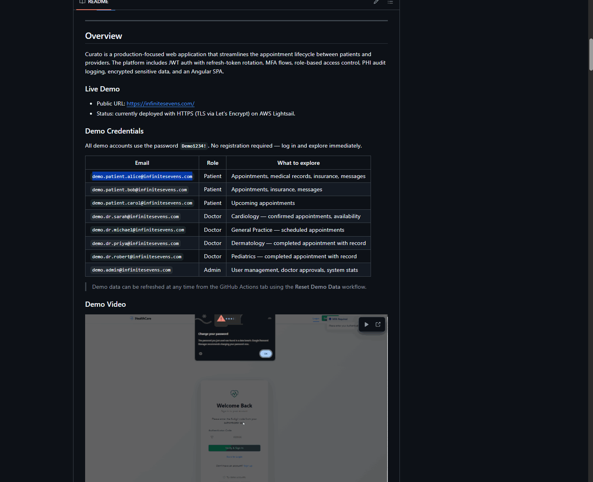

<p align="center">
  <h1 align="center">Curato</h1>
  <p align="center">
    A full-stack, HIPAA-aware healthcare appointment platform with role-based access control for patients, doctors, and administrators.
    <br />
    <strong>Angular 21 · Node.js · TypeScript · MySQL</strong>
  </p>
</p>

<p align="center">
  <a href="https://github.com/isomer04/curato/actions/workflows/ci.yml"></a>
  <a href="LICENSE"></a>
  
  
  
</p>

---

## Overview

Curato streamlines the appointment lifecycle between patients and providers. It
pairs an Angular single-page app with a layered Express API and includes JWT auth
with refresh-token rotation, MFA, role-based access control, PHI audit logging,
and encrypted sensitive data.

**Live demo:** ~~deployed with HTTPS on AWS Lightsail.~~ **Currently down** — AWS free tier expired; redeployment pending. See the [demo gif](assets/curato.gif) below.



### Demo Credentials

All demo accounts use the password **`Demo1234!`**. No registration required.

| Email | Role | What to explore |
| ----- | ---- | --------------- |
| `demo.patient.alice@infinitesevens.com` | Patient | Appointments, medical records, insurance, messages |
| `demo.dr.sarah@infinitesevens.com` | Doctor | Cardiology — confirmed appointments, availability |
| `demo.admin@infinitesevens.com` | Admin | User management, doctor approvals, system stats |

> More demo accounts are listed in the [Development Guide](docs/development.md).
> To explore with demo data locally, see the [Quick Start](#quick-start) below — the seed script populates these accounts on a fresh database.

---

## Features

- **Authentication** — JWT access/refresh rotation, role-based authorization, MFA, email verification, password reset, and account-lockout protection.
- **Patient portal** — search doctors, book slots, view appointment history, export medical records (CSV/PDF), manage insurance and profile.
- **Doctor portal** — manage availability, confirm and complete appointments, review authorized patient context.
- **Admin portal** — manage users and roles, approve doctors, verify insurance, view system metrics.
- **Messaging** — direct messaging with unread counters and read-state updates.
- **Notifications** — real-time alerts, with appointment events emitted only after the database transaction commits.

---

## Tech Stack

| Layer       | Technology                                      |
| ----------- | ----------------------------------------------- |
| Frontend    | Angular 21, TypeScript 5.9, Bootstrap 5.3, SCSS |
| Backend     | Node.js 22, Express 5, TypeScript 5.9           |
| Database    | MySQL 8, Sequelize 6                            |
| Auth        | JWT, bcrypt, otplib                             |
| Validation  | Zod                                             |
| Email       | SendGrid (@sendgrid/mail)                       |
| Logging     | Winston                                         |
| Security    | Helmet, CORS, rate-limiter-flexible             |
| Dev Tooling | ESLint, Prettier, Jest, ts-node-dev             |

---

## Quick Start

```bash
npm run install:all
cp backend/.env.example backend/.env
cd backend && npm run migrate
npx ts-node scripts/create-phi-audit-table.ts
cd ..
npm start
```

Local URLs:

- Frontend: http://localhost:4200
- Backend API: http://localhost:3000
- Health check: http://localhost:3000/api/v1/health

Full setup, Docker, migrations, scripts, and testing are covered in the
[Development Guide](docs/development.md).

---

## Documentation

| Topic | Document |
| ----- | -------- |
| Local setup, Docker, scripts, testing | [docs/development.md](docs/development.md) |
| Environment variables | [docs/configuration.md](docs/configuration.md) |
| Architecture and database schema | [docs/architecture.md](docs/architecture.md) |
| Security and HIPAA controls | [docs/security.md](docs/security.md) |
| API reference | [docs/api-reference.md](docs/api-reference.md) |
| API versioning policy | [docs/api-versioning.md](docs/api-versioning.md) |
| Production deployment (AWS Lightsail) | [docs/deployment.md](docs/deployment.md) |
| Threat model | [docs/threat-model.md](docs/threat-model.md) |
| Release / rollback checklist | [docs/release-checklist.md](docs/release-checklist.md) |

---

## Contributing

1. Fork the repository and create a branch for your change.
2. Implement and test your update.
3. Ensure backend and frontend lint and relevant tests pass.
4. Keep API contract changes in sync across backend and frontend.
5. Open a pull request using the templates under `.github/pull_request_template`.

---

## License

This project is licensed under the [MIT License](LICENSE).
